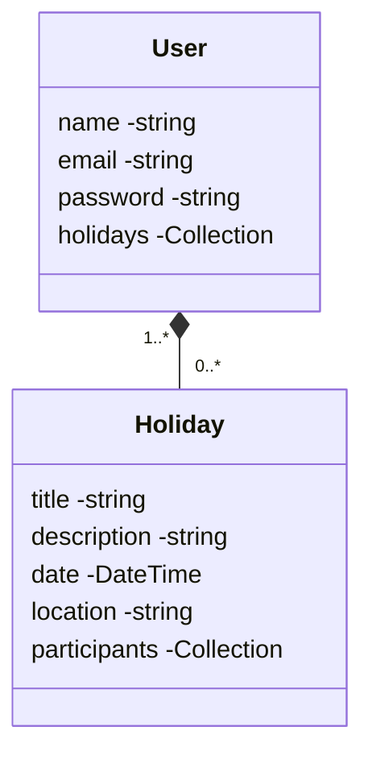

```mermaid
---
Modelagem UML das models
---
classDiagram
    class User {
        name -string
        email -string
        password -string
    }
    class Holiday {
        title -string
        description -string
        date -DateTime
        location -string
    }
    User: holidays -Collection<Holiday>
    Holiday: participants -Collection<User>
    User "1..*" *-- "0..*" Holiday
```
