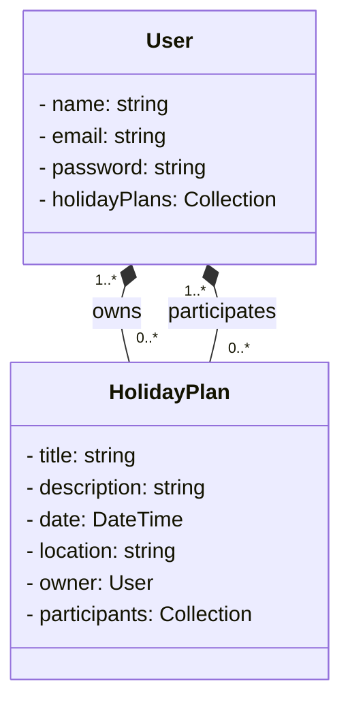
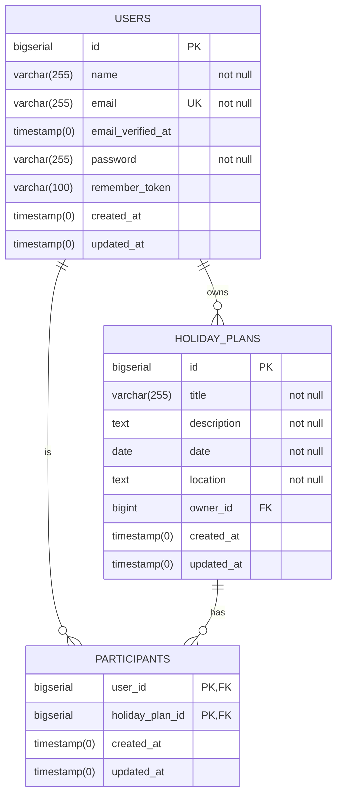

# Modelagem UML

## Diagrama de Classes

```mermaid
---
Modelagem UML das models
---
classDiagram
    class User {
        - name: string
        - email: string
        - password: string
        - holidayPlans: Collection<HolidayPlan>
    }
    class HolidayPlan {
        - title: string
        - description: string
        - date: DateTime
        - location: string
        - owner: User
        - participants: Collection<User>
    }
    User "1..*" *-- "0..*" HolidayPlan : owns
    User "1..*" *-- "0..*" HolidayPlan : participates
```

## Diagrama de Entidade-Relacionamento

```mermaid
---
Modelagem ER do banco de dados
---
erDiagram
    USERS {
        bigserial id PK
        varchar(255) name "not null"
        varchar(255) email UK "not null"
        timestamp(0) email_verified_at
        varchar(255) password "not null"
        varchar(100) remember_token
        timestamp(0) created_at
        timestamp(0) updated_at
    }
    HOLIDAY_PLANS {
        bigserial id PK
        varchar(255) title "not null"
        text description "not null"
        date date "not null"
        text location "not null"
        bigint owner_id FK
        timestamp(0) created_at
        timestamp(0) updated_at
    }
    PARTICIPANTS {
        bigserial user_id PK, FK
        bigserial holiday_plan_id PK, FK
        timestamp(0) created_at
        timestamp(0) updated_at
    }
    USERS ||--o{ PARTICIPANTS : is
    HOLIDAY_PLANS ||--o{ PARTICIPANTS : has
    USERS ||--o{ HOLIDAY_PLANS : owns
```
